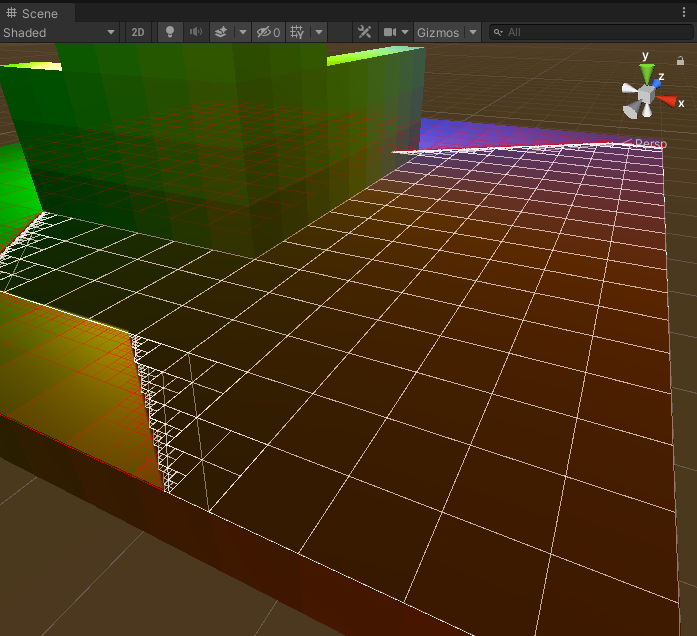

# Hiding-Ball

### Summary

2 balls, one is emmiting light, the second one is hiding from the light.

### Creating the Ground

First I create a Ground with the width, height and size that I want :

|                         8x8 - Size 1                         |                       20x20 - Size 0.5                       |                      40x40 Size : 0.25                       |
| :----------------------------------------------------------: | :----------------------------------------------------------: | :----------------------------------------------------------: |
|  |  |  |

### Creating wall and obstacles

The idea here is to add with a simple click, cubes, to create shadows due to the red ball which is representing a light. It could be interesting to remove cube so I added this feature :

* **Left click** add cube
* **Right click** remove cube

### Quadtree and shadow

The best way to get the shadows would be to use shadowmap, but it's painful to use and I want to implement it with another way. 

We will use **Quadtree**. Why ?

* Quadtree is fast.
* Quadtree is efficient. 
* I can handle the number of subdivision to have a better precision.
* It avoid a lot of useless calculation.

|                           Original                           |                        Subdivision 2                         |                        Subdivision 4                         |                        Subdivision 6                         |
| :----------------------------------------------------------: | :----------------------------------------------------------: | :----------------------------------------------------------: | :----------------------------------------------------------: |
|  |  |  |  |

​        

Our way to do it (using ray cast and if we are touching a wall, we are in shadow) is not the best, but it's fast and do the job.

 

We can improve our method by avoiding to go into the square that are "fully" in shadow.

|                           Original                           |                        Subdivision 2                         |                        Subdivision 4                         |                        Subdivision 6                         |
| :----------------------------------------------------------: | :----------------------------------------------------------: | :----------------------------------------------------------: | :----------------------------------------------------------: |
|  |  |  |  |

​          

That way we can even use subdivion 8 (which is taking a bit of time previously ~8s to around ~1s now). It's taking that much time to draw the "debug" lines. Without take it takes less time.

 

As you can see there is still weird behaviors at some part. The issue here is that I used only one cube to check if I am into shadow or not. The solution there would be to get the **neighbors**

Indeed checking if you have neighbors on **left-right** , **top-down**, **front-back** would give us information if we should go deeper or not. 

|                           Original                           |                          Left-Right                          |                           Top-Down                           |                          Front-Back                          |
| :----------------------------------------------------------: | :----------------------------------------------------------: | :----------------------------------------------------------: | :----------------------------------------------------------: |
|  |  |  |  |

If we merge all the neighbors together we finally get our final result : 

The result is really good even if at some place subdivision are operated and it shouldn't, but I don't know why. Maybe it comes from numerical float error.

### Merging the shadow as area

